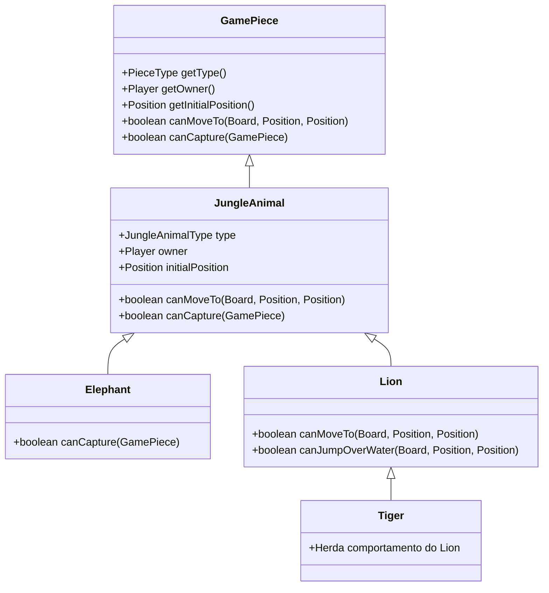
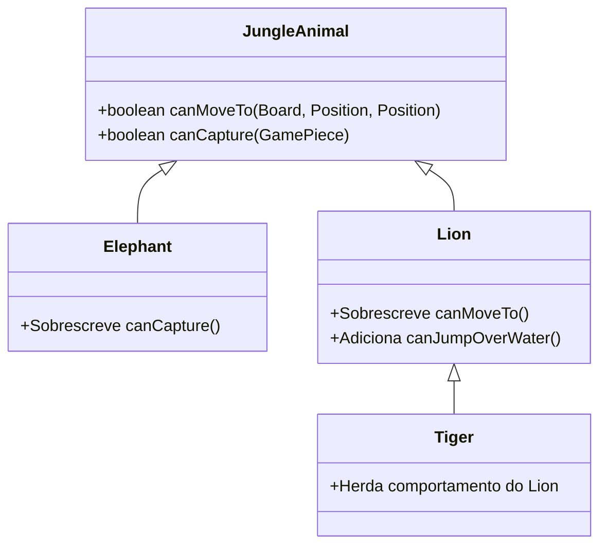

# Jogo da Selva - Padrões de Projeto

## Introdução
O jogo da Selva ("Jungle") é um jogo de tabuleiro inspirado no xadrez, onde animais com diferentes hierarquias se enfrentam. Neste projeto, utilizamos os padrões de projeto **Decorator** e **Template Method** para estruturar as classes dos animais e seus comportamentos.

## 1. Padrão Decorator

### Intenção do Padrão (conforme Gama)
O padrão **Decorator** permite estender o comportamento de objetos de maneira flexível e dinâmica, sem alterar as classes base, adicionando funcionalidades de forma transparente e modular.

### Motivação
No jogo da Selva, cada animal possui características específicas que podem variar conforme o tipo de animal (por exemplo, o Leão pode pular sobre a água, enquanto o Elefante não pode capturar o Rato). A implementação direta dessas características resultaria em um código rígido e de difícil manutenção. O padrão **Decorator** permite modularizar essas variações sem modificar diretamente as classes dos animais.

### Cenário sem o Padrão
Na ausência do padrão **Decorator**, as funcionalidades específicas dos animais seriam implementadas diretamente nas classes concretas. Isso resultaria em uma complexidade elevada e em dificuldades de extensão ou manutenção, pois cada nova funcionalidade exigiria alterações nas classes base.

#### Classes Envolvidas
- `GamePiece` (interface)
- `JungleAnimal` (classe base para todos os animais)
- `Elephant`, `Lion`, `Tiger` (classes concretas com comportamento específico)

#### UML sem o Padrão

```mermaid
classDiagram
    class GamePiece {
        +PieceType getType()
        +Player getOwner()
        +Position getInitialPosition()
        +boolean canMoveTo(Board, Position, Position)
        +boolean canCapture(GamePiece)
    }

    class JungleAnimal {
        +JungleAnimalType type
        +Player owner
        +Position initialPosition
    }

    class Elephant {
        +boolean canCapture(GamePiece)
    }

    class Lion {
        +boolean canMoveTo(Board, Position, Position)
        +boolean canJumpOverWater(Board, Position, Position)
    }

    class Tiger {
        +Herda comportamento do Lion
    }

    GamePiece <|-- JungleAnimal
    JungleAnimal <|-- Elephant
    JungleAnimal <|-- Lion
    Lion <|-- Tiger
```

### Estrutura do Padrão (Decorator)
O padrão **Decorator** é aplicado utilizando a classe base `JungleAnimal` para fornecer comportamentos comuns e permitir que subclasses específicas estendam ou modifiquem suas funcionalidades.

#### UML com o Padrão Decorator

### Participantes
| GOF               | Implementação no Jogo                |
|------------------|--------------------------------------|
| **Component**     | `GamePiece` (interface com métodos gerais) |
| **ConcreteComponent** | `JungleAnimal` (implementa a interface) |
| **Decorator**     | `JungleAnimal` (classe base que permite extensões) |
| **ConcreteDecorator** | `Elephant`, `Lion`, `Tiger` (adicionam funcionalidades específicas) |

---

## 2. Padrão Template Method

### Intenção do Padrão (conforme Gama)
O padrão **Template Method** define a estrutura de um algoritmo na superclasse, permitindo que subclasses sobrescrevam etapas específicas sem modificar a estrutura do algoritmo.

### Motivação
No jogo da Selva, muitos animais compartilham comportamentos similares, como movimentação e captura, mas com pequenas variações. O padrão **Template Method** permite que a lógica geral seja definida na classe abstrata `JungleAnimal`, enquanto os detalhes específicos são sobrescritos nas subclasses.

### Cenário sem o Padrão
Sem o uso do **Template Method**, cada animal precisaria implementar totalmente seus métodos de movimentação e captura, resultando em duplicação de código e dificuldades de manutenção.

#### Classes Envolvidas
- `JungleAnimal` (classe base com métodos genéricos)
- `Elephant`, `Lion`, `Tiger` (subclasses que implementam variações)

#### UML sem o Padrão

### Participantes
| GOF               | Implementação no Jogo                                      |
|------------------|--------------------------------------------------------------|
| **AbstractClass** | `JungleAnimal` (define a estrutura padrão dos métodos)       |
| **ConcreteClass** | `Elephant`, `Lion`, `Tiger` (sobrescrevem comportamentos específicos) |

