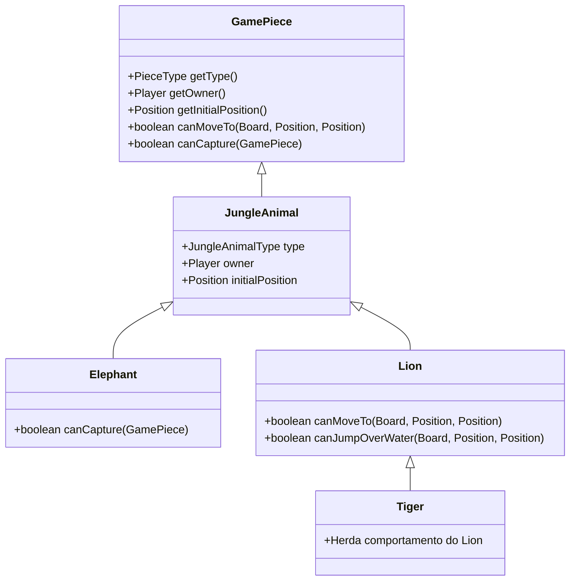
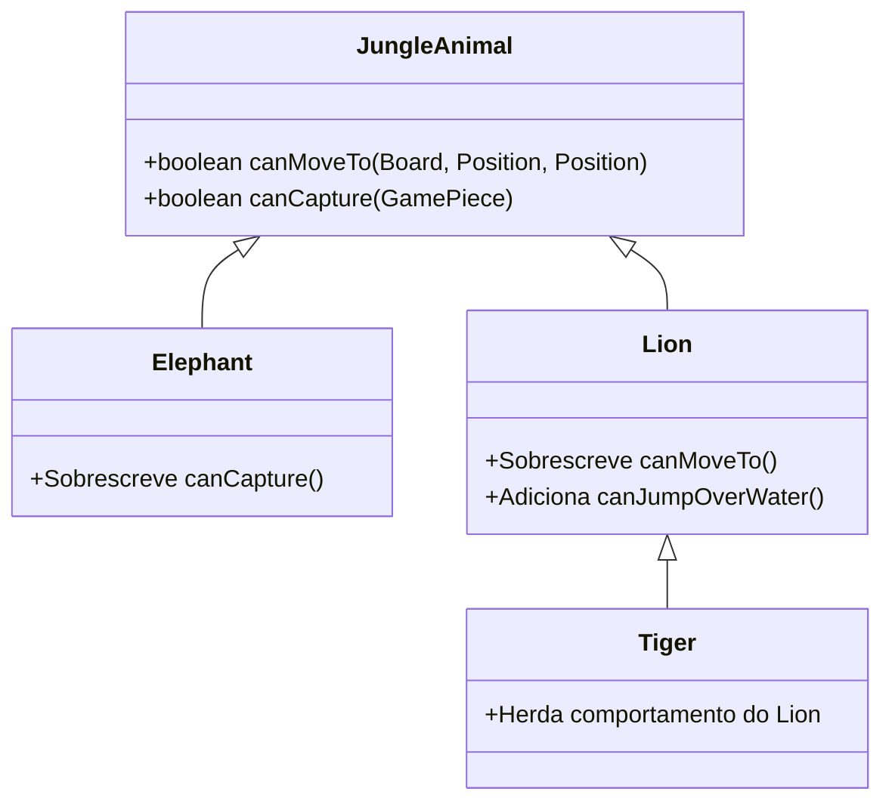

# Jogo da Selva - Padrões de Projeto

## Introdução
O jogo da Selva (“Jungle”) é um jogo de tabuleiro inspirado no xadrez, onde animais com diferentes hierarquias se enfrentam. Neste projeto, utilizamos os padrões de projeto **Decorator** e **Template Method** para estruturar as classes dos animais e seus comportamentos.


## Padrões Utilizados

### 1. **Decorator**
O padrão **Decorator** é utilizado para adicionar funcionalidades específicas a determinados animais sem modificar suas classes base. Ele permite estender o comportamento de um objeto de forma flexível.

#### UML do Decorator



#### Código Correspondente
```java
/**
 * Implementação do Elefante
 * PADRÃO ESTRUTURAL: DECORATOR para funcionalidades específicas
 */
public class Elephant extends JungleAnimal {
    public Elephant(Player owner, Position initialPosition) {
        super(JungleAnimalType.ELEPHANT, owner, initialPosition);
    }
    
    @Override
    public boolean canCapture(GamePiece target) {
        if (target.getType() == JungleAnimalType.RAT) {
            return false; // Elefante não pode capturar o rato
        }
        return super.canCapture(target);
    }
}
```

```java
/**
 * Implementação do Leão
 * PADRÃO ESTRUTURAL: DECORATOR para adicionar pulo sobre água
 */
public class Lion extends JungleAnimal {
    public Lion(Player owner, Position initialPosition) {
        super(JungleAnimalType.LION, owner, initialPosition);
    }
    
    @Override
    public boolean canMoveTo(Board board, Position from, Position to) {
        // Verificar movimento normal
        if (super.canMoveTo(board, from, to)) {
            return true;
        }
        
        // Verificar pulo sobre água
        return canJumpOverWater(board, from, to);
    }
}
```


### 2. **Template Method**
O padrão **Template Method** é utilizado na classe abstrata `JungleAnimal`, onde a lógica padrão de movimentação e captura é definida, permitindo que subclasses sobrescrevam apenas partes específicas do comportamento.

#### UML do Template Method


#### Código Correspondente
```java
/**
 * Implementação abstrata para todos os animais do jogo da Selva
 */
public abstract class JungleAnimal implements GamePiece {
    protected JungleAnimalType type;
    protected Player owner;
    protected Position initialPosition;
    
    public JungleAnimal(JungleAnimalType type, Player owner, Position initialPosition) {
        this.type = type;
        this.owner = owner;
        this.initialPosition = initialPosition;
    }
    
    @Override
    public PieceType getType() {
        return type;
    }
    
    @Override
    public Player getOwner() {
        return owner;
    }
    
    @Override
    public Position getInitialPosition() {
        return initialPosition;
    }
    
    @Override
    public boolean canMoveTo(Board board, Position from, Position to) {
        int dx = Math.abs(to.getX() - from.getX());
        int dy = Math.abs(to.getY() - from.getY());
        
        if (!((dx == 1 && dy == 0) || (dx == 0 && dy == 1))) {
            return false;
        }
        
        Cell targetCell = board.getCell(to);
        if (targetCell.getType() == CellType.WATER && type != JungleAnimalType.RAT) {
            return false;
        }
        
        if (targetCell.isOccupied()) {
            return canCapture(targetCell.getOccupant());
        }
        
        return true;
    }
    
    @Override
    public boolean canCapture(GamePiece target) {
        if (target.getOwner().equals(owner)) {
            return false;
        }
        
        JungleAnimalType targetType = (JungleAnimalType) target.getType();
        return type.getRank() >= targetType.getRank();
    }
}
```


## Comparativo dos Participantes dos Padrões Utilizados com o GOF

### **Decorator**
| GOF | Implementação no Jogo |
|------|--------------------|
| **Component** | `GamePiece` (Interface com métodos gerais) |
| **ConcreteComponent** | `JungleAnimal` (Implementa a interface) |
| **Decorator** | `JungleAnimal` (Classe base que permite extensões) |
| **ConcreteDecorator** | `Elephant`, `Lion`, `Tiger` (Adicionam funcionalidades específicas) |

### **Template Method**
| GOF | Implementação no Jogo |
|------|--------------------|
| **AbstractClass** | `JungleAnimal` (Define a estrutura padrão dos métodos) |
| **ConcreteClass** | `Elephant`, `Lion`, `Tiger` (Sobrescrevem comportamentos específicos) |


