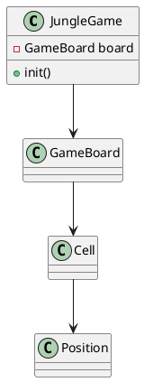
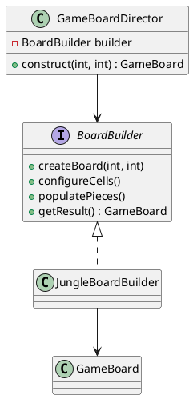
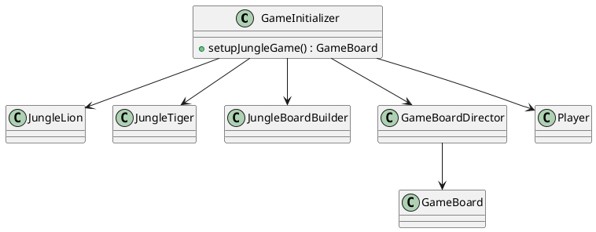
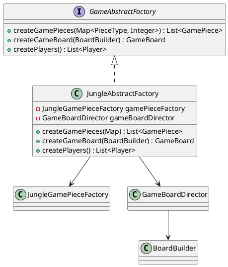

# Jogo da Selva - Padrões de Projeto

O jogo da Selva (*Jungle*) é um jogo de tabuleiro inspirado no xadrez, onde animais com diferentes hierarquias se enfrentam. Neste projeto, utilizamos os padrões de projeto **Decorator** e **Template Method** para estruturar as classes dos animais e seus comportamentos.

---

## 1. Padrão Builder

### Intenção do Padrão
Separar a construção de um objeto complexo da sua representação de modo que o
mesmo processo de construção possa criar diferentes representações.

### Motivação  
No framework de jogos de tabuleiro, cada jogo (Selva, Xadrez, Damas …) possui:

* tamanhos de tabuleiro distintos;  
* tipos de células próprios (água, armadilha, castelo, casa escura);  
* regras de posicionamento inicial exclusivas.

Se cada jogo **construísse seu tabuleiro “na mão”**, o código‐cliente ficaria repleto de `new Cell(...)`, `setCellType(...)`, laços aninhados e **ordem de chamadas difícil de manter**. O **Builder** encapsula esse processo, permitindo que:

* o **framework** defina *o que* precisa ser feito;  
* cada jogo decida *como* fazer.

### Cenário sem o Padrão  
Todo o código de montagem ficaria em uma única classe de jogo:

```java
class JungleGame {
    GameBoard board = new GameBoard(7, 9);

    void init() {
        // cria células
        for (int x = 0; x < 7; x++)
            for (int y = 0; y < 9; y++)
                board.addCell(new Cell(new Position(x, y)));

        // configura água
        ...
        // configura armadilhas
        ...
        // posiciona peças
        ...
    }
}
```

#### Problemas  
* Repetição do mesmo “ritual” em todo novo jogo.  
* Ordem de passos rígida: qualquer erro quebra a montagem.  
* Nenhuma reutilização entre jogos.

#### UML sem o Padrão


### Estrutura do padrão


### Padrão aplicado no cenário
Com o padrão **Builder**, o framework define uma interface `BoardBuilder` com os passos genéricos para construção de qualquer tabuleiro. Cada jogo concreto, como o Jogo da Selva, implementa esses passos no `JungleBoardBuilder`.

Um diretor (`GameBoardDirector`) conhece apenas a sequência genérica de montagem, não os detalhes de cada jogo, e é capaz de construir qualquer tabuleiro usando um builder adequado.

#### Classes envolvidas
- `BoardBuilder` (interface)
- `JungleBoardBuilder`, `ChessBoardBuilder` (builders concretos)
- `GameBoardDirector` (diretor)
- `GameBoard` (produto final)

#### UML com o padrão aplicado


### Participantes (alinhados ao GOF)

| GOF               | Implementação no Projeto                       |
|------------------|-------------------------------------------------|
| **Builder**       | `BoardBuilder` – interface genérica para construção de tabuleiros |
| **ConcreteBuilder** | `JungleBoardBuilder`, – implementam a construção específica de cada jogo |
| **Director**      | `GameBoardDirector` – orquestra os passos da construção |
| **Product**       | `GameBoard` – representação final do tabuleiro construído |

### Código


#### Código do Framework
@import "./src/framework/patterns/builder/BoardBuilder.java"

@import "./src/framework/patterns/builder/GameBoardDirector.java"

#### Código do Jogo Selva
@import "./src/games/jungle/patterns/builder/JungleBoardBuilder.java"

---

## 2. Padrão Abstract Factory

### Intenção do Padrão 
Fornecer uma interface para criação de famílias de objetos relacionados ou dependentes sem especificar suas classes concretas.

### Motivação  
No contexto de um **framework de jogos de tabuleiro**, é necessário que cada jogo seja capaz de:

* Criar suas **peças de jogo** com características próprias;  
* Instanciar o **tabuleiro** conforme sua lógica de construção (já encapsulada no `BoardBuilder`);  
* Definir os **jogadores** participantes da partida.

Sem o uso do padrão Abstract Factory, o código do framework ficaria acoplado às classes concretas de cada jogo (por exemplo: `JungleGamePiece`, `JungleBoardBuilder`, etc.), **violando o princípio da inversão de dependência** e prejudicando a reutilização.

Com o padrão, o framework lida com uma **fábrica abstrata** (`GameAbstractFactory`), permitindo que cada jogo implemente sua própria lógica de criação.

### Cenário sem o Padrão  
O código do framework precisaria conhecer e instanciar diretamente as classes concretas específicas de cada jogo:

```java
class GameInitializer {

    public GameBoard setupJungleGame() {
        // Criando peças diretamente (sem flyweight)
        List<GamePiece> pieces = new ArrayList<>();
        pieces.add(new JungleLion(PieceType.LION, "JunglePlayer1"));
        pieces.add(new JungleTiger(PieceType.TIGER, "JunglePlayer2"));
        // ... outras peças

        // Criando tabuleiro manualmente
        JungleBoardBuilder builder = new JungleBoardBuilder();
        GameBoardDirector director = new GameBoardDirector(builder);
        GameBoard board = director.construct(7, 9);

        // Criando jogadores diretamente
        List<Player> players = List.of(new Player("JunglePlayer1"), new Player("JunglePlayer2"));

        // Retorna o tabuleiro (mas lógica está fragmentada)
        return board;
    }
}
```

#### Problemas  
* O framework precisa conhecer classes concretas do Jogo da Selva.  
* Dificulta a adição de novos jogos: cada novo jogo requer alteração no código do framework.  
* Quebra o **Open-Closed Principle** (princípio do aberto-fechado).

#### UML sem o Padrão


### Estrutura do padrão  


### Padrão aplicado no cenário  
O framework define a interface `GameAbstractFactory`, que declara métodos para criação dos principais componentes de um jogo:

- `createGamePieces(...)`  
- `createGameBoard(...)`  
- `createPlayers()`

Cada jogo, como o Jogo da Selva, implementa essa interface em uma fábrica concreta (`JungleAbstractFactory`), que utiliza seus próprios objetos (`JungleGamePieceFactory`, `JungleBoardBuilder`, `Player`, etc.).

#### Classes envolvidas
- `GameAbstractFactory` (interface)
- `JungleAbstractFactory` (fábrica concreta do Jogo da Selva)
- `JungleGamePieceFactory` (fábrica de peças específicas)
- `GameBoardDirector` (diretor de construção de tabuleiros)
- `BoardBuilder` (builder concreto usado na construção do tabuleiro)

#### UML com o padrão aplicado


### Participantes (alinhados ao GOF)

| GOF                  | Implementação no Projeto                               |
|----------------------|---------------------------------------------------------|
| **AbstractFactory**   | `GameAbstractFactory` – interface genérica para criação de jogos |
| **ConcreteFactory**   | `JungleAbstractFactory` – implementação específica do jogo da Selva |
| **Product**           | `GamePiece`, `GameBoard`, `Player` – elementos a serem criados |
| **ConcreteProduct**   | `JungleGamePiece`, `JungleBoard`, jogadores do Jogo da Selva |

### Código

#### Código do Framework
@import "./src/framework/patterns/abstractFactory/GameAbstractFactory.java"

#### Código do Jogo Selva
@import "./src/games/jungle/patterns/abstractFactory/JungleAbstractFactory.java"

---

