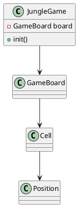
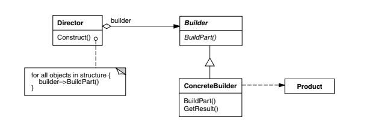
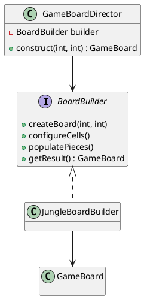

# Jogo da Selva - Padrões de Projeto

O jogo da Selva (*Jungle*) é um jogo de tabuleiro inspirado no xadrez, onde animais com diferentes hierarquias se enfrentam. Neste projeto, utilizamos os padrões de projeto **Decorator** e **Template Method** para estruturar as classes dos animais e seus comportamentos.

---

## 1. Padrão Builder

### Intenção do Padrão (conforme Gama)
Separar a construção de um objeto complexo da sua representação de modo que o
mesmo processo de construção possa criar diferentes representações.

### Motivação  
No framework de jogos de tabuleiro, cada jogo (Selva, Xadrez, Damas …) possui:

* tamanhos de tabuleiro distintos;  
* tipos de células próprios (água, armadilha, castelo, casa escura);  
* regras de posicionamento inicial exclusivas.

Se cada jogo **construísse seu tabuleiro “na mão”**, o código‐cliente ficaria repleto de `new Cell(...)`, `setCellType(...)`, laços aninhados e **ordem de chamadas difícil de manter**. O **Builder** encapsula esse processo, permitindo que:

* o **framework** defina *o que* precisa ser feito;  
* cada jogo decida *como* fazer.

### Cenário sem o Padrão  
Todo o código de montagem ficaria em uma única classe de jogo:

```java
class JungleGame {
    GameBoard board = new GameBoard(7, 9);

    void init() {
        // cria células
        for (int x = 0; x < 7; x++)
            for (int y = 0; y < 9; y++)
                board.addCell(new Cell(new Position(x, y)));

        // configura água
        ...
        // configura armadilhas
        ...
        // posiciona peças
        ...
    }
}
```

#### Problemas  
* Repetição do mesmo “ritual” em todo novo jogo.  
* Ordem de passos rígida: qualquer erro quebra a montagem.  
* Nenhuma reutilização entre jogos.

#### UML sem o Padrão


### Estrutura do padrão


### Padrão aplicado no cenário
Com o padrão **Builder**, o framework define uma interface `BoardBuilder` com os passos genéricos para construção de qualquer tabuleiro. Cada jogo concreto, como o Jogo da Selva, implementa esses passos no `JungleBoardBuilder`.

Um diretor (`GameBoardDirector`) conhece apenas a sequência genérica de montagem, não os detalhes de cada jogo, e é capaz de construir qualquer tabuleiro usando um builder adequado.

#### Classes envolvidas
- `BoardBuilder` (interface)
- `JungleBoardBuilder`, `ChessBoardBuilder` (builders concretos)
- `GameBoardDirector` (diretor)
- `GameBoard` (produto final)

#### UML com o padrão aplicado


### Participantes (alinhados ao GOF)

| GOF               | Implementação no Projeto                       |
|------------------|-------------------------------------------------|
| **Builder**       | `BoardBuilder` – interface genérica para construção de tabuleiros |
| **ConcreteBuilder** | `JungleBoardBuilder`, – implementam a construção específica de cada jogo |
| **Director**      | `GameBoardDirector` – orquestra os passos da construção |
| **Product**       | `GameBoard` – representação final do tabuleiro construído |

### Código


#### Código do Framework
@import "./src/framework/patterns/builder/BoardBuilder.java"

@import "./src/framework/patterns/builder/GameBoardDirector.java"

#### Código do Jogo Selva
@import "./src/games/jungle/patterns/builder/JungleBoardBuilder.java"
