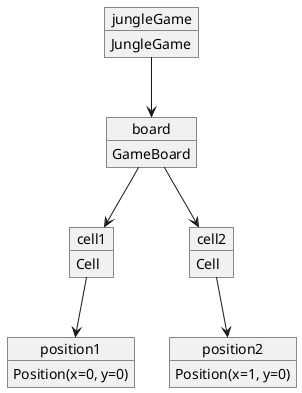
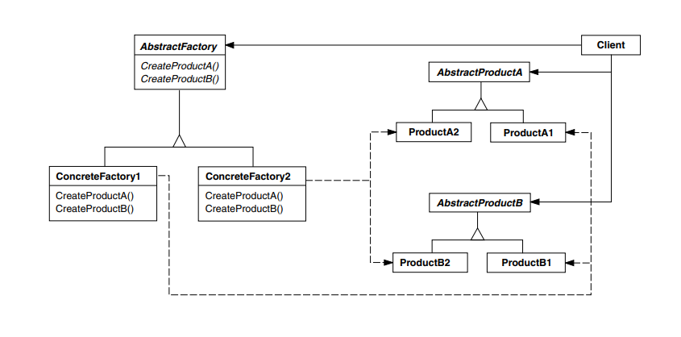
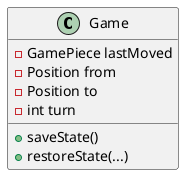
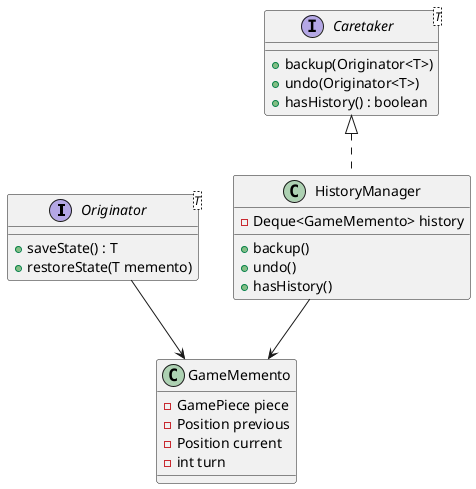
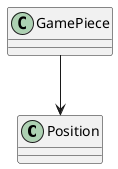
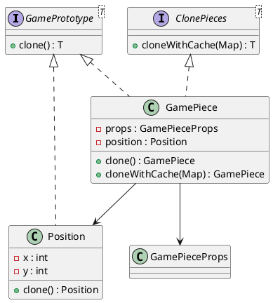

# Jogo da Selva - Padrões de Projeto

O jogo da Selva (*Jungle*) é um jogo de tabuleiro inspirado no xadrez, onde animais com diferentes hierarquias se enfrentam. Neste projeto, utilizamos os padrões de projeto **Decorator** e **Template Method** para estruturar as classes dos animais e seus comportamentos.

---

## 1. Padrão Builder

### Intenção do Padrão
Separar a construção de um objeto complexo da sua representação de modo que o
mesmo processo de construção possa criar diferentes representações.

### Motivação  
No framework de jogos de tabuleiro, cada jogo (Selva, Xadrez, Damas …) possui:

* tamanhos de tabuleiro distintos;  
* tipos de células próprios (água, armadilha, castelo, casa escura);  
* regras de posicionamento inicial exclusivas.

Se cada jogo **construísse seu tabuleiro “na mão”**, o código‐cliente ficaria repleto de `new Cell(...)`, `setCellType(...)`, laços aninhados e **ordem de chamadas difícil de manter**. O **Builder** encapsula esse processo, permitindo que:

* o **framework** defina *o que* precisa ser feito;  
* cada jogo decida *como* fazer.

### Cenário sem o Padrão  
Todo o código de montagem ficaria em uma única classe de jogo:

```java
class JungleGame {
    GameBoard board = new GameBoard(7, 9);

    void init() {
        // cria células
        for (int x = 0; x < 7; x++)
            for (int y = 0; y < 9; y++)
                board.addCell(new Cell(new Position(x, y)));

        // configura água
        ...
        // configura armadilhas
        ...
        // posiciona peças
        ...
    }
}
```

#### Problemas  
* Repetição do mesmo “ritual” em todo novo jogo.  
* Ordem de passos rígida: qualquer erro quebra a montagem.  
* Nenhuma reutilização entre jogos.

#### UML sem o Padrão


### Estrutura do padrão


### Padrão aplicado no cenário
Com o padrão **Builder**, o framework define uma interface `BoardBuilder` com os passos genéricos para construção de qualquer tabuleiro. Cada jogo concreto, como o Jogo da Selva, implementa esses passos no `JungleBoardBuilder`.

Um diretor (`GameBoardDirector`) conhece apenas a sequência genérica de montagem, não os detalhes de cada jogo, e é capaz de construir qualquer tabuleiro usando um builder adequado.

#### Classes envolvidas
- `BoardBuilder` (interface)
- `JungleBoardBuilder`, `ChessBoardBuilder` (builders concretos)
- `GameBoardDirector` (diretor)
- `GameBoard` (produto final)

#### UML com o padrão aplicado


### Participantes

| GOF               | Implementação no Projeto                       |
|------------------|-------------------------------------------------|
| **Builder**       | `BoardBuilder` – interface genérica para construção de tabuleiros |
| **ConcreteBuilder** | `JungleBoardBuilder`, – implementam a construção específica de cada jogo |
| **Director**      | `GameBoardDirector` – orquestra os passos da construção |
| **Product**       | `GameBoard` – representação final do tabuleiro construído |

### Código


#### Código do Framework
@import "./src/framework/patterns/creational/builder/BoardBuilder.java"

@import "./src/framework/patterns/creational/builder/GameBoardDirector.java"

#### Código do Jogo Selva
@import "./src/games/jungle/patterns/builder/JungleBoardBuilder.java"

---

## 2. Padrão Abstract Factory

### Intenção do Padrão 
Fornecer uma interface para criação de famílias de objetos relacionados ou dependentes sem especificar suas classes concretas.

### Motivação  
No contexto de um **framework de jogos de tabuleiro**, é necessário que cada jogo seja capaz de:

* Criar suas **peças de jogo** com características próprias;  
* Instanciar o **tabuleiro** conforme sua lógica de construção (já encapsulada no `BoardBuilder`);  
* Definir os **jogadores** participantes da partida.

Sem o uso do padrão Abstract Factory, o código do framework ficaria acoplado às classes concretas de cada jogo (por exemplo: `JungleGamePiece`, `JungleBoardBuilder`, etc.), **violando o princípio da inversão de dependência** e prejudicando a reutilização.

Com o padrão, o framework lida com uma **fábrica abstrata** (`GameAbstractFactory`), permitindo que cada jogo implemente sua própria lógica de criação.

### Cenário sem o Padrão  
O código do framework precisaria conhecer e instanciar diretamente as classes concretas específicas de cada jogo:

```java
class GameInitializer {

    public GameBoard setupJungleGame() {
        // Criando peças diretamente (sem flyweight)
        List<GamePiece> pieces = new ArrayList<>();
        pieces.add(new JungleLion(PieceType.LION, "JunglePlayer1"));
        pieces.add(new JungleTiger(PieceType.TIGER, "JunglePlayer2"));
        // ... outras peças

        // Criando tabuleiro manualmente
        JungleBoardBuilder builder = new JungleBoardBuilder();
        GameBoardDirector director = new GameBoardDirector(builder);
        GameBoard board = director.construct(7, 9);

        // Criando jogadores diretamente
        List<Player> players = List.of(new Player("JunglePlayer1"), new Player("JunglePlayer2"));

        // Retorna o tabuleiro (mas lógica está fragmentada)
        return board;
    }
}
```

#### Problemas  
* O framework precisa conhecer classes concretas do Jogo da Selva.  
* Dificulta a adição de novos jogos: cada novo jogo requer alteração no código do framework.  
* Quebra o **Open-Closed Principle** (princípio do aberto-fechado).

#### UML sem o Padrão


### Estrutura do padrão  


### Padrão aplicado no cenário  
O framework define a interface `GameAbstractFactory`, que declara métodos para criação dos principais componentes de um jogo:

- `createGamePieces(...)`  
- `createGameBoard(...)`  
- `createPlayers()`

Cada jogo, como o Jogo da Selva, implementa essa interface em uma fábrica concreta (`JungleAbstractFactory`), que utiliza seus próprios objetos (`JungleGamePieceFactory`, `JungleBoardBuilder`, `Player`, etc.).

#### Classes envolvidas
- `GameAbstractFactory` (interface)
- `JungleAbstractFactory` (fábrica concreta do Jogo da Selva)
- `JungleGamePieceFactory` (fábrica de peças específicas)
- `GameBoardDirector` (diretor de construção de tabuleiros)
- `BoardBuilder` (builder concreto usado na construção do tabuleiro)

#### UML com o padrão aplicado


### Participantes

| GOF                  | Implementação no Projeto                               |
|----------------------|---------------------------------------------------------|
| **AbstractFactory**   | `GameAbstractFactory` – interface genérica para criação de jogos |
| **ConcreteFactory**   | `JungleAbstractFactory` – implementação específica do jogo da Selva |
| **Product**           | `GamePiece`, `GameBoard`, `Player` – elementos a serem criados |
| **ConcreteProduct**   | `JungleGamePiece`, `JungleBoard`, jogadores do Jogo da Selva |

### Código

#### Código do Framework
@import "./src/framework/patterns/creational/abstractFactory/GameAbstractFactory.java"

#### Código do Jogo Selva
@import "./src/games/jungle/patterns/abstractFactory/JungleAbstractFactory.java"


---

## 3. Padrão Flyweight

### Intenção do Padrão 
Usar compartilhamento para suportar eficientemente grandes quantidades de objetos de granularidade fina.

### Motivação  
No jogo da Selva (e em outros jogos de tabuleiro), diversas peças do mesmo tipo são criadas repetidamente, com comportamento e atributos idênticos (por exemplo, várias peças "Rato", "Tigre", etc.). Se cada instância replicar os mesmos dados (nome, tipo, lógica de movimento…), haverá:

* desperdício de memória;  
* necessidade de manter cópias redundantes dos mesmos dados.

Com o padrão **Flyweight**, os dados imutáveis e compartilháveis são armazenados em um único objeto (`GamePieceProps`), que é **reutilizado** por todas as instâncias de peças do mesmo tipo.

### Cenário sem o Padrão  
Sem Flyweight, cada peça armazena seus próprios atributos e lógica de movimentação:

```java
class JungleGamePiece {
    private final String name;
    private final PieceType type;
    private final Move moveChain;

    public JungleGamePiece(String name, PieceType type) {
        this.name = name;
        this.type = type;
        this.moveChain = JungleMoveFactory.getInstance().createMoveChain(type);
    }

    public void move(Position dest, GameBoard board) {
        if (!moveChain.move(getPosition(), dest, board)) {
            throw new InvalidMovementException("Movimento inválido!");
        }
    }
}
```

#### Problemas  
* Cada peça ocupa espaço duplicado com atributos idênticos (nome, tipo, lógica de movimento).  
* A criação de múltiplas peças torna-se mais custosa em termos de memória.  
* A lógica de movimentação não é reaproveitada.

#### UML sem o Padrão  


### Estrutura do Padrão  


### Padrão aplicado no cenário  
Com o Flyweight, criamos um objeto compartilhável e imutável (`GamePieceProps`), contendo os dados comuns a todas as peças de um mesmo tipo. O objeto `GamePiece` passa a receber essa referência e delegar a ela os dados e comportamentos.

O `JungleGamePieceFactory` usa uma `Map` interna (`gamePieceProMap`) para garantir que cada tipo de peça compartilhe o mesmo `GamePieceProps`.

#### Classes envolvidas  
- `GamePieceProps` – contém os dados compartilhados: tipo da peça, cadeia de movimentos.  
- `GamePiece` – peça concreta, que usa `GamePieceProps` para delegar comportamentos.  
- `JungleGamePieceFactory` – responsável por criar e gerenciar instâncias flyweight.  
- `JungleMoveFactory` – cria a lógica de movimentação para cada tipo de peça.

#### UML com o padrão aplicado  


### Participantes

| GOF               | Implementação no Projeto                                |
|------------------|----------------------------------------------------------|
| **Flyweight**      | `GamePieceProps` – dados compartilháveis entre instâncias |
| **ConcreteFlyweight** | Instâncias de `GamePieceProps` com atributos definidos por tipo |
| **FlyweightFactory** | `JungleGamePieceFactory` – gerencia e reaproveita flyweights |
| **Client**         | `GamePiece` – usa `GamePieceProps` compartilhado |


### Código

#### Código do Framework
@import "./src/framework/patterns/structural/flyweight/GamePiece.java"  
@import "./src/framework/patterns/structural/flyweight/GamePieceProps.java"

#### Código do Jogo Selva
@import "./src/games/jungle/patterns/factory/flyweight/JungleGamePieceFactory.java"

---

## 4. Padrão Factory

### Intenção do Padrão  
Definir uma interface para criar um objeto, mas deixar as subclasses decidirem qual classe instanciar. O padrão Factory permite adiar a instanciação para subclasses.

### Motivação  
No framework, cada jogo precisa criar peças com comportamentos específicos, como:

* diferentes regras de movimentação (`MoveHandler`);  
* tipos únicos de peças (como `Mouse`, `Elephant`, `Tiger` no Jungle);  
* quantidades variáveis por tipo.

Sem o padrão Factory, a lógica de criação ficaria espalhada, resultando em **código duplicado, difícil de manter e testar**.

### Cenário sem o Padrão  
Cada jogo implementaria diretamente a criação de peças:

```java
class JungleGame {
    List<GamePiece> pieces;

    void init() {
        pieces = new ArrayList<>();
        pieces.add(new GamePiece(new GamePieceProps(JunglePieceType.MOUSE, new TerritoryRestriction())));
        pieces.add(new GamePiece(new GamePieceProps(JunglePieceType.LION, new LeapOverRiver())));
        ...
    }
}
```

#### Problemas  
* Repetição de lógica em cada jogo.  
* Dificuldade para configurar cadeias de movimentação (Chain of Responsibility).  
* Nenhuma reutilização ou centralização da criação.

#### UML sem o Padrão  


### Estrutura do padrão


### Padrão aplicado no cenário  
Com o padrão **Factory**, o framework define a classe abstrata `GamePieceFactory`, que centraliza a criação de peças de forma genérica. Jogos específicos como Jungle implementam sua própria fábrica (`JungleGamePieceFactory`) para configurar regras e movimentações exclusivas.

A lógica de movimentação é extraída para uma classe separada (`JungleMoveFactory`), que decide quais `MoveHandlers` devem ser aplicados para cada tipo de peça, seguindo o padrão Chain of Responsibility.

#### Classes envolvidas  
- `GamePieceFactory` (classe abstrata base)  
- `JungleGamePieceFactory` (fábrica concreta)  
- `JungleMoveFactory` (fábrica de regras de movimentação)  
- `GamePiece` (produto final com propriedades compartilhadas – padrão Flyweight)  
- `GamePieceProps` (propriedades da peça – tipo e movimento)

#### UML com o padrão aplicado  


### Participantes

| GOF               | Implementação no Projeto                          |
|------------------|----------------------------------------------------|
| **Product**        | `GamePiece` – representação da peça criada        |
| **Creator**        | `GamePieceFactory` – classe abstrata de criação   |
| **ConcreteCreator**| `JungleGamePieceFactory` – cria peças específicas |
| **Factory Method** | `createGamePiece(...)` – encapsula a criação de peças |

### Código

#### Código do Framework  
@import "./src/framework/patterns/creational/factory/GamePieceFactory.java"

#### Código do Jogo Selva  
@import "./src/games/jungle/patterns/factory/AbstractJungleMoveFactory.java"  
@import "./src/games/jungle/patterns/factory/JungleMoveFactory.java"


---

## 5. Padrão Chain of Responsibility

### Intenção do Padrão  
Evitar o acoplamento do remetente de uma solicitação ao seu receptor, permitindo que mais de um objeto possa tratar a solicitação. Encadeia os objetos receptores e passa a solicitação ao longo da cadeia até que ela seja tratada.

### Motivação  
No framework de jogos, diferentes peças têm **regras de movimentação compostas** por:

* restrições de território (não entrar na toca inimiga);
* bloqueios por terreno (água, armadilhas…);
* alcance máximo;
* movimentos especiais (pulo sobre rio, etc.).

Se cada tipo de peça precisasse implementar todas as regras diretamente, teríamos **métodos complexos e difíceis de reutilizar**.

Com o padrão **Chain of Responsibility**, cada regra vira um manipulador (`MoveHandler`) independente e reutilizável, que pode ser encadeado de forma flexível para definir o comportamento da peça.

### Cenário sem o Padrão  
As regras de movimentação estariam todas misturadas em um único método:

```java
boolean move(Position from, Position to, GameBoard board) {
    if (board.getCell(to).getType() == WATER) return false;
    if (!isOwnTerritory(from, to)) return false;
    if (!canLeapOverRiver(from, to, board)) return false;
    ...
    return true;
}
```

#### Problemas  
* Código rígido, difícil de alterar ou extender.  
* Nenhuma reutilização entre diferentes tipos de peças.  
* A ordem das verificações precisa ser manualmente mantida.

#### UML sem o padrão  


### Estrutura do Padrão  


### Padrão aplicado no cenário  
Com o padrão **Chain of Responsibility**, cada validação é implementada como um manipulador (`MoveHandler`). A `JungleMoveFactory` define a cadeia de regras apropriadas para cada tipo de peça, como:

- `Range`: limite de alcance  
- `WaterBlock`: impede entrada na água  
- `TerritoryRestriction`: impede entrada na toca inimiga  
- `LeapOverRiver`: movimento especial do leão e tigre

Cada manipulador decide se processa ou repassa a requisição ao próximo da cadeia.

#### Classes envolvidas  
- `Move` (interface para movimentação)  
- `MoveHandler` (classe abstrata da cadeia)  
- `TerritoryRestriction`, `LeapOverRiver`, `WaterBlock`, `Range` (handlers concretos)  
- `JungleMoveFactory` (fábrica que monta a cadeia conforme o tipo da peça)

#### UML com o padrão aplicado  


### Participantes

| GOF                 | Implementação no Projeto                    |
|---------------------|---------------------------------------------|
| **Handler**          | `MoveHandler` – define interface comum      |
| **ConcreteHandler**  | `Range`, `WaterBlock`, etc. – regras reais |
| **Client**           | `GamePiece` – delega a verificação à cadeia |
| **Request**          | `move(from, to, board)` – verificação de movimento |

### Código

#### Código do Framework  
@import "./src/framework/patterns/behavioral/chainOfRespo/Move.java"

@import "./src/framework/patterns/behavioral/chainOfRespo/MoveHandler.java"

#### Código do Jogo Selva  
@import "./src/games/jungle/patterns/chainOfRespo/TerritoryRestriction.java"

@import "./src/games/jungle/patterns/chainOfRespo/WaterBlock.java"

@import "./src/games/jungle/patterns/chainOfRespo/LeapOverRiver.java"

@import "./src/games/jungle/patterns/chainOfRespo/Range.java"

---

## 6. Padrão Command

### Intenção do Padrão 
Encapsular uma solicitação como um objeto, permitindo parametrizar clientes com diferentes solicitações, enfileirar ou registrar solicitações e suportar operações que podem ser desfeitas.

### Motivação  
No framework de jogos de tabuleiro, uma jogada pode envolver diversas ações, como:

* mover uma peça;
* capturar outra peça;
* passar a vez;
* futuramente, desfazer uma jogada.

Essas ações devem ser registradas e executadas de forma uniforme, permitindo que o jogo:

* armazene o histórico das jogadas;
* desacople a lógica de execução da interface de usuário;
* permita futuramente *undo/redo* de comandos.

O **Command** encapsula cada jogada como um objeto autônomo, com uma interface comum (`execute()`), delegando ao objeto o conhecimento de **como** realizar sua ação.

### Cenário sem o Padrão  
O jogo teria que executar cada tipo de jogada diretamente:

```java
// mover
GamePiece piece = board.getPieceAt(from);
piece.move(to, board);

// capturar
GamePiece captured = board.getPieceAt(to);
board.getPieces().remove(captured);
```

#### Problemas  
* Código repetido para cada tipo de jogada;  
* Difícil manter histórico de ações para desfazer;  
* Sem encapsulamento da ação: controller e lógica do jogo ficam acoplados.

#### UML sem o padrão  


### Estrutura do padrão  


### Padrão aplicado no cenário  
Com o padrão **Command**, cada ação é transformada em um comando que implementa a interface `GameCommand`. Isso permite:

* guardar as ações em lista para refazer ou desfazer;
* executar comandos de forma polimórfica;
* associar comandos a botões ou eventos de forma desacoplada.

#### Classes envolvidas  
- `GameCommand` (interface comum)  
- `MoveCommand`, `CapturePieceCommand`, `PassTurnCommand` (comandos concretos)  
- `GameBoard`, `GamePiece` – usadas dentro dos comandos para executar ações

#### UML com o padrão aplicado  


### Participantes 

| GOF             | Implementação no Projeto                                      |
|----------------|---------------------------------------------------------------|
| **Command**      | `GameCommand` – define a interface para todos os comandos     |
| **ConcreteCommand** | `MoveCommand`, `CapturePieceCommand`, `PassTurnCommand` – implementam ações específicas |
| **Receiver**     | `GameBoard`, `GamePiece` – objetos que executam as ações      |
| **Invoker**      | (implícito – pode ser o controller do jogo ou gerenciador de turnos) |
| **Client**       | Código do jogo – instancia e executa comandos                 |

### Código

#### Código do Framework
@import "./src/framework/patterns/behavioral/command/GameCommand.java"

@import "./src/framework/patterns/behavioral/command/MoveCommand.java"

@import "./src/framework/patterns/behavioral/command/CapturePieceCommand.java"

@import "./src/framework/patterns/behavioral/command/PassTurnCommand.java"

---

Aqui está a **nova versão da seção do padrão Memento**, atualizada conforme sua implementação:

---

## 7. Padrão Memento

### Intenção do Padrão  
Sem violar o encapsulamento, capturar e externalizar o estado interno de um objeto para que ele possa ser restaurado posteriormente.

### Motivação  
Em jogos de tabuleiro, é comum o jogador querer **voltar uma jogada**, por exemplo:

* desfazer um movimento mal planejado;
* corrigir um erro;
* testar possibilidades diferentes.

Em vez de clonar todo o tabuleiro e jogadores, o sistema armazena apenas o estado **essencial da jogada**: peça movimentada, posição anterior, posição atual e turno. Essa abordagem é mais leve e eficiente.

### Cenário sem o padrão  
O estado teria que ser salvo manualmente em diferentes estruturas:

```java
GamePiece piece = board.getPieceAt(from);
savedPiece = piece;
savedFrom = from;
savedTo = to;
savedTurn = turn;
```

#### Problemas  
* Backup espalhado e não coeso;  
* Risco de inconsistência entre as variáveis salvas;  
* Dificuldade de encapsular e restaurar corretamente o estado.

#### UML sem o padrão  


### Estrutura do padrão  


### Padrão aplicado no cenário  
O padrão **Memento** é usado para capturar apenas as informações **mínimas e relevantes** da jogada. A `GameSession` atua como Originator e implementa `saveState()` e `restoreState()`.

Cada memento (`GameMemento`) armazena a peça movida, a posição anterior, a nova posição e o turno. O `HistoryManager` (Caretaker) mantém uma pilha desses mementos e permite desfazer ações anteriores.

#### Classes envolvidas  
- `Originator<T>` – interface que define `saveState()` e `restoreState()`  
- `GameSession` – origem do estado, que sabe como criar e restaurar mementos  
- `GameMemento` – encapsula os dados essenciais da jogada  
- `HistoryManager` – armazena e gerencia os mementos  
- `Caretaker<T>` – interface para gerenciar o histórico

#### UML com o padrão aplicado  


### Participantes

| GOF              | Implementação no Projeto                          |
|------------------|----------------------------------------------------|
| **Originator**     | `GameSession`, via `Originator<GameMemento>`       |
| **Memento**        | `GameMemento` – contém peça, posições e turno       |
| **Caretaker**      | `HistoryManager` – controla o histórico de jogadas |
| **Client**         | `GameSession` – solicita backup e restauração       |

### Código

#### Código do Framework
@import "./src/framework/patterns/behavioral/memento/Originator.java"

@import "./src/framework/patterns/behavioral/memento/Caretaker.java"

@import "./src/framework/patterns/behavioral/memento/GameMemento.java"

@import "./src/framework/patterns/behavioral/memento/HistoryManager.java"

@import "./src/framework/patterns/structural/facade/GameSession.java"

---


## 8. Padrão Singleton

### Intenção do Padrão 
Garantir que uma classe tenha **apenas uma instância** e fornecer um **ponto global de acesso** a ela.

### Motivação  
No framework de jogos, é necessário manter um único ponto de controle da partida em andamento. Essa responsabilidade é atribuída ao `GameManager`, que:

* centraliza o acesso ao jogo atual;
* gerencia a instância da `GameSession` (e seu proxy);
* permite executar ações como **mover**, **passar turno**, **desfazer**.

Usar o padrão **Singleton** garante que **haverá apenas um `GameManager` ativo por aplicação**, evitando conflitos de estado.

### Cenário sem o padrão  
A criação do gerenciador ficaria solta na aplicação:

```java
GameManager manager1 = new GameManager();  
GameManager manager2 = new GameManager();  
manager1.move(...);  
manager2.undo(); // estados diferentes!
```

#### Problemas  
* Múltiplas instâncias com dados divergentes;  
* Difícil coordenar ações entre partes do sistema;  
* Possível sobreposição ou perda de dados.

#### UML sem o padrão  


### Estrutura do padrão  


### Padrão aplicado no cenário  
Com o padrão **Singleton**, a classe `GameManager`:

* possui um construtor privado;  
* armazena uma instância estática de si mesma;  
* fornece um método `getInstance()` para acesso controlado.

#### Classes envolvidas  
- `GameManager` – classe Singleton que centraliza toda a lógica da partida

#### UML com o padrão aplicado  


### Participantes

| GOF              | Implementação no Projeto                      |
|------------------|-----------------------------------------------|
| **Singleton**     | `GameManager` – garante uma instância única da gerência de jogo |

### Código

#### Código do Framework
@import "./src/framework/patterns/creational/singleton/GameManager.java"

---

Aqui está a nova versão da seção do **Padrão Prototype**, atualizada conforme a sua implementação:

---

## 9. Padrão Prototype

### Intenção do Padrão  
Especificar os tipos de objetos a serem criados usando uma **instância prototípica** e criar novos objetos pela **cópia desse protótipo**.

### Motivação  
Ao desfazer jogadas ou simular ações no jogo, é necessário **reproduzir o estado atual de peças, posições e entidades móveis** de forma confiável.  
Em vez de reconstruir manualmente, usamos o padrão **Prototype** para clonar objetos como `Position` e `GamePiece`.

### Cenário sem o padrão  
Cada elemento teria que implementar cópia manualmente:

```java
Position newPos = new Position(old.x(), old.y());
GamePiece newPiece = new GamePiece(old.getProps());
newPiece.setPosition(newPos);
```

#### Problemas  
* Código repetitivo e propenso a erros;  
* Risco de esquecer partes internas (como `props` ou `position`);  
* Dificuldade para aplicar cache ou controle de referência.

#### UML sem o padrão  


### Estrutura do padrão  


### Padrão aplicado no cenário  
Os objetos `Position` e `GamePiece` implementam a interface `GamePrototype<T>`, com o método `clone()`.  
Além disso, `GamePiece` implementa `ClonePieces<T>` para suportar **cache de clonagem**, o que evita a duplicação de instâncias já clonadas — essencial em jogos com múltiplas referências compartilhadas.

#### Classes envolvidas  
- `GamePrototype<T>` – interface de clonagem genérica  
- `ClonePieces<T>` – interface para clonagem com cache  
- `Position` – posição no tabuleiro (imutável, mas clonável)  
- `GamePiece` – peça do jogo, com `GamePieceProps` reutilizáveis (Flyweight)

#### UML com o padrão aplicado  


### Participantes 

| GOF                 | Implementação no Projeto                          |
|---------------------|----------------------------------------------------|
| **Prototype**         | `GamePrototype<T>` – interface de clonagem        |
| **ConcretePrototype** | `Position`, `GamePiece` – implementações concretas |
| **Client**            | `GameSession`, `HistoryManager` – consomem cópias |

### Código

#### Código do Framework
@import "./src/framework/patterns/creational/prototype/GamePrototype.java"  
@import "./src/framework/patterns/creational/prototype/Position.java"  
@import "./src/framework/patterns/structural/flyweight/GamePiece.java"  
@import "./src/framework/core/ClonePieces.java"

---

## 10. Padrão Facade

### Intenção do Padrão 
Fornecer uma **interface unificada** para um **conjunto de interfaces** em um subsistema. **Facade** define uma interface de nível mais alto que torna o subsistema mais fácil de usar.

### Motivação  
Em jogos de tabuleiro digitais, o gerenciamento da lógica de jogo envolve múltiplas operações de diferentes partes do sistema: movimentação, troca de turno, desfazer ações, histórico, controle de peças e jogadores, etc.

A classe `GameSession` atua como **fachada**, encapsulando toda essa complexidade e expondo uma interface simples (`IGameSession`) para o restante do sistema (por exemplo, `GameManager` ou a interface do usuário).

### Cenário sem o padrão  
Sem o padrão Facade, o código que gerencia a lógica do jogo precisaria se comunicar diretamente com várias classes:

```java
GameBoard board = factory.createGameBoard();
List<Player> players = factory.createPlayers();
List<GamePiece> pieces = factory.createGamePieces();

board.setPieces(pieces);
// distribuir peças manualmente...
// criar comandos e gerenciar histórico...
```

#### Problemas  
* Código duplicado e acoplado  
* Aumento da complexidade para usuários do subsistema  
* Dificuldade de manutenção e testes

#### UML sem o padrão  


### Estrutura do padrão  


### Padrão aplicado no cenário  
A classe `GameSession` encapsula toda a lógica necessária para a execução de um jogo:  
- Inicializa tabuleiro, peças e jogadores  
- Executa comandos (mover, passar turno)  
- Gerencia histórico de ações (memento)  
- Permite desfazer comandos  
- Garante encapsulamento e simplicidade para quem consome o sistema

A interface `IGameSession` é utilizada por clientes como o `GameManager`, ocultando os detalhes internos.

#### Classes envolvidas  
- `GameSession` – a fachada, que centraliza e abstrai a lógica do jogo  
- `GameBoard`, `Player`, `GamePiece`, `GameCommand`, `HistoryManager`, etc. – subsistema encapsulado  
- `IGameSession` – interface externa exposta ao cliente (como o `GameManager`)

#### UML com o padrão aplicado  


### Participantes 

| GOF           | Implementação no Projeto       |
|----------------|------------------------------|
| **Facade**       | `GameSession`                  |
| **Subsistemas**  | `GameBoard`, `Player`, `GameCommand`, `HistoryManager`, etc. |
| **Cliente**      | `GameManager` e demais chamadas externas |

### Código

#### Código do Framework
@import "./src/framework/patterns/structural/facade/GameSession.java"  
@import "./src/framework/patterns/structural/proxy/IGameSession.java"

---


## 11. Padrão Proxy

### Intenção do Padrão 
Fornecer um **representante ou substituto** para outro objeto para controlar o acesso a ele.

### Motivação  
Em jogos multiplayer, é essencial restringir ações para que apenas o jogador da vez possa movimentar peças, passar o turno ou desfazer jogadas. O padrão **Proxy** oferece uma camada de proteção, impedindo que outros jogadores acessem métodos indevidamente.

Neste projeto, `GameSessionProxy` atua como um intermediário entre o jogador e a `GameSession`, garantindo que apenas o jogador autorizado (com ID válido) execute ações.

### Cenário sem o padrão  
Sem o proxy, qualquer jogador teria acesso direto à `GameSession`, podendo executar comandos indevidamente:

```java
gameSession.move(posA, posB); // Qualquer jogador
gameSession.undo();           // Pode causar conflitos de estado
```

#### Problemas  
* Falta de controle de acesso  
* Ações fora do turno permitidas  
* Quebra de regras do jogo

#### UML sem o padrão  
```plantuml
@startuml
class GameSession {
  +move()
  +passTurn()
  +undo()
  +board()
  +currentPlayer()
}
GameManager --> GameSession
@enduml
```

### Estrutura do padrão  


### Padrão aplicado no cenário  
A interface `IGameSession` abstrai o contrato da sessão de jogo.  
`GameSessionProxy` implementa essa interface e **verifica se o jogador atual tem permissão para executar a ação** antes de delegar para a `GameSession`.

#### Benefícios  
* Controle de acesso em tempo de execução  
* Transparência para quem usa a interface (`IGameSession`)  
* Encapsulamento das regras de autorização

#### Classes envolvidas  
- `IGameSession` – interface comum para sessão real e proxy  
- `GameSessionProxy` – o proxy que valida permissões  
- `GameSession` – a sessão real que executa as ações  
- `GameManager` – cliente que interage apenas com a interface

#### UML com o padrão aplicado  
```plantuml
@startuml
interface IGameSession {
  +move()
  +undo()
  +passTurn()
  +board()
  +currentPlayer()
}

class GameSession {
  +move()
  +undo()
  +passTurn()
  +board()
  +currentPlayer()
}

class GameSessionProxy {
  -GameSession realSession
  -String allowedPlayerId
  +move()
  +undo()
  +passTurn()
}

IGameSession <|.. GameSession
IGameSession <|.. GameSessionProxy

GameManager --> IGameSession
GameSessionProxy --> GameSession
@enduml
```

### Participantes

| GOF         | Implementação no Projeto     |
|-------------|------------------------------|
| **Subject**     | `IGameSession`               |
| **Proxy**       | `GameSessionProxy`           |
| **RealSubject** | `GameSession`                |

### Código

#### Código do Framework
@import "./src/framework/patterns/structural/proxy/GameSessionProxy.java"  
@import "./src/framework/patterns/structural/proxy/IGameSession.java"


Aqui está a versão atualizada da seção do padrão **Iterator**, agora incluindo a **influência da biblioteca padrão do Java (`java.util.Iterator` e `java.lang.Iterable`)**:

---

## 12. Padrão Iterator

### Intenção do Padrão  
Fornecer uma maneira de acessar sequencialmente os elementos de um objeto agregado sem expor sua representação subjacente.

### Motivação  
No jogo da Selva, é comum percorrer todas as peças para realizar ações como:

* aplicar movimentações;
* distribuir peças entre jogadores;
* verificar estado de peças (capturadas, ativas…).

A classe `PieceDeck` representa um conjunto de peças e implementa `Iterable<GamePiece>`, permitindo uso direto de `for-each` e integração com APIs funcionais.

### Influência da Biblioteca Java  
O padrão **Iterator** é fortemente incorporado à linguagem Java por meio das interfaces `java.lang.Iterable<T>` e `java.util.Iterator<T>`, amplamente utilizadas em coleções como `List`, `Set`, `Map` e `Stream`.

A implementação do padrão neste projeto **adere à especificação da linguagem**, garantindo compatibilidade com estruturas do Java e reduzindo a necessidade de iteradores personalizados.

```java
for (GamePiece piece : pieceDeck) {
    // uso natural do padrão Iterator em Java
}
```

#### Benefícios dessa integração  
* Compatibilidade com estruturas Java (`for-each`, `Stream`, `Collectors`)  
* Abstração da estrutura de dados interna (`List<GamePiece>`)  
* Facilita testes, composição e extensibilidade

### Cenário sem o padrão  
A lista de peças teria que ser exposta diretamente:

```java
for (GamePiece p : pieceDeck.getAll()) {
    // operação sobre a peça
}
```

#### Problemas  
* Acoplamento à estrutura da lista interna;  
* Nenhuma abstração para iteração;  
* Código menos expressivo e reutilizável.

#### UML sem o padrão  
```plantuml
@startuml
class PieceDeck {
  -pieces : List<GamePiece>
  +getAll() : List<GamePiece>
}
@enduml
```

### Estrutura do padrão  


### Padrão aplicado no cenário  
A classe `PieceDeck` implementa `Iterable<GamePiece>` e expõe `iterator()` e `stream()`. Isso permite tanto iteração externa (`for-each`) quanto uso de streams funcionais.

#### Classes envolvidas  
- `PieceDeck` – coleção iterável de peças (`Iterable<GamePiece>`)  
- `GamePiece` – elementos da coleção  
- `Iterator` – iterador da lista  
- `Stream<GamePiece>` – abstração funcional

#### UML com o padrão aplicado  
```plantuml
@startuml
interface Iterable<T> {
  +iterator() : Iterator<T>
}

class PieceDeck {
  -pieces : List<GamePiece>
  +iterator() : Iterator<GamePiece>
  +stream() : Stream<GamePiece>
  +add(GamePiece)
  +get(int) : GamePiece
  +size() : int
  +getAll() : List<GamePiece>
}

PieceDeck --> GamePiece
Iterable <|.. PieceDeck
@enduml
```

### Participantes 

| GOF              | Implementação no Projeto                          |
|------------------|----------------------------------------------------|
| **Iterator**       | `Iterator<GamePiece>` – retorno de `pieces.iterator()` |
| **Aggregate**      | `PieceDeck` – encapsula e expõe coleção iterável |
| **Client**         | Código do jogo (`for-each`, `stream()`, etc.)     |

### Código

#### Código do Framework
@import "./src/framework/patterns/behavioral/iterator/PieceDeck.java"